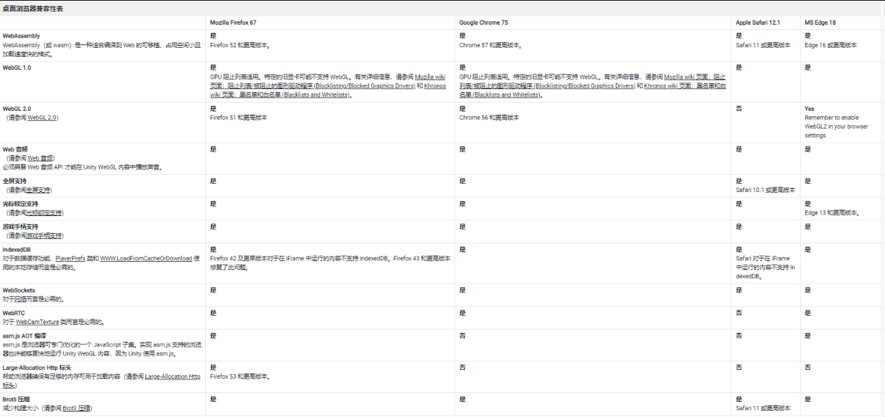
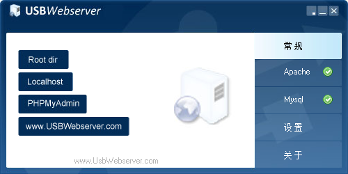
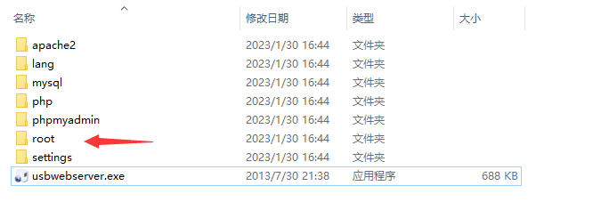
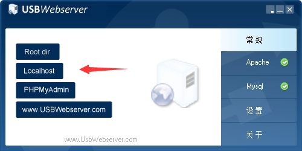

### 前言

时代在进步，风水轮流转，早期pc客户端进化到web1.0静态网站的时代，内容仅被私人用于，信息只可以被读，目的是传递信息。Web 2.0 是 Web 发展的第二个阶段，网站在这个阶段扩展了他们的交互能力，内容可以被分享。而 Web 3.0 是 Web 发展的最新一步，内容将归集体所有并共享，Web 3.0 力求沉浸式体验。

客户端与web最大的区别在于方便，一个链接即可以直接呈现展示内容

[webgl展示](WebGL - HDRu3dc.com/3d/examples/hdr.html)

### 方案

目前市面上主流方案基于跨平台unityH5、原生方案、渲染库（ThreeJs）各有优缺点，
今天主要介绍跨平台方案，方便多端部署
早期Unity平台web方案使用的是UnityPlayer,后面多数浏览器都已经能够很好的支持 Html5，因此 WebGL 也更加成熟，为了将项目发布为 WebGL 平台，在打包的时候，Unity 利用 Emscripten 工具链，将引擎的 C/C++ 代码转换为 WebAssembly（一种浏览器可以执行的格式，更加高效），而 C#代码则需要先通过 IL2CPP转换为 C/C++代码，在转换为 WebAssembly。

### 注意要点

另外由于平台限制，有些功能在 WebGL 上是不支持的:

* 不支持多线程，因为 JavaScript 不支持多线程，所以 `System.Threading` 命名空间下的类不要使用；
* 不能在 VS 中进行断点调试，后面会介绍如何进行调试；
* 不能直接使用 Socket，包括 `System.Net`下的任何类型，以及 `System.Net.Sockets` 下的部分类型，以及 `UnityEngine.Network`，如果需要在 WebGL 平台使用网络功能，可以使用 `WWW`或者 `UnityWebRequest`这些都是基于 `Http`协议的实现，如要需要高实时性，可以选择 `WebSockets`或者 `WebRTC`;
* WebGL 1.0是基于 OpenGL ES 2.0，WebGL 2.0基于 OpenGL ES 3.0，所以存在相应的限制；
* WebGL 音频是基于自定义的后台，只具备基本的音频功能；
* WebGL 是 AOT(ahead of time，即静态编译平台，因此不能使用 `System.Reflection.Emit` 下的类型进行代码生成，IL2CPP和 iOS 也是如此。
* 通常，纹理 (Textures)、声音 (Sounds) 和动画 (Animations) 等内容占用的空间最多，而脚本 (Scripts)、关卡 (Levels) 和着色器 (Shaders) 一般影响最小。[优化构建大小](https://docs.unity.cn/cn/current/Manual/ReducingFilesize.html "优化构建大小")

### 浏览器支持

Unity WebGL 在某种程度上支持所有主流桌面浏览器。但是，不同浏览器的支持程度和预期性能会有所不同。请参阅下表，了解 Unity WebGL 内容相关的浏览器功能以及支持这些功能的浏览器。

请注意，移动设备目前不支持 Unity WebGL 内容。Unity WebGL 内容可能仍然有效，特别是在高端设备上，但许多当前设备的性能不够强大，也没有足够的内存来充分支持该内容。因此，Unity WebGL 尝试在移动端浏览器上加载内容时会显示警告消息（如果需要，可禁用警告）。

请注意，此兼容性表对于所述的具体浏览器版本有效。支持能力在将来的版本中应该会更进一步，但在以前的版本中可能不稳定。

### 部署测试

这里采用方便携带，快捷使用的usbwebserver

将打包好的文件放入root目录即可

单击以按钮即可打开网页测试

